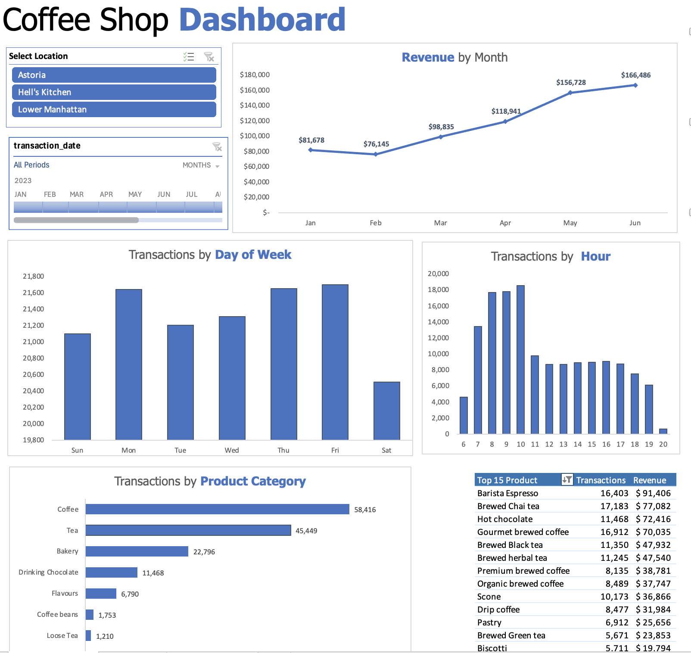
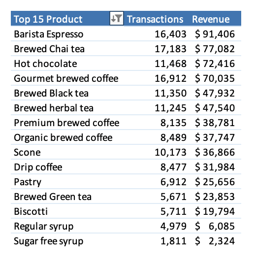
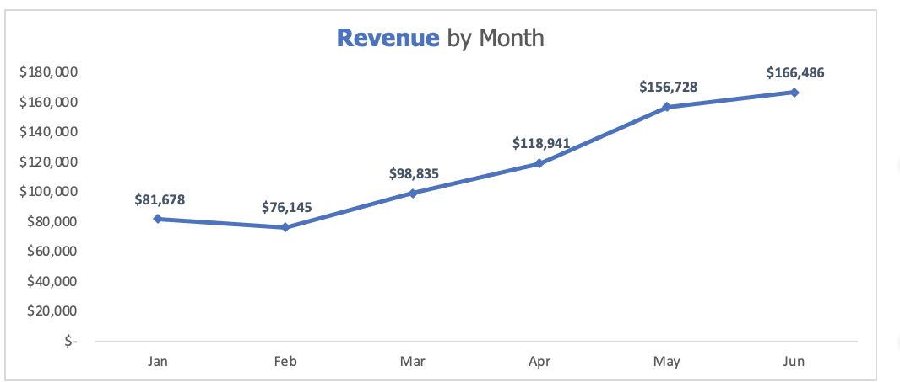

# Coffee-Sales-Analysis---Excel

This repository contains an Excel dashboard analyzing transaction data from a coffee shop chain with three locations in New York City: Lower Manhattan, Hell's Kitchen, and Astoria. The data spans January to June 2023 and includes details on products sold, transaction times, and revenue. The dashboard offers actionable insights to optimize operations, boost revenue, and enhance customer satisfaction.

---

## Table of Contents

- [Contents](#contents)
- [Usage](#usage)
- [Analysis Overview](#analysis-overview)
- [Screenshots](#screenshots)
- [Data Sources](#data-sources)
- [Tools and Techniques](#tools-and-techniques)
- [Contributing](#contributing)

---

## Contents

- **`Coffee_Shop_Dashboard.xlsx`**: The Excel file containing the raw transaction data and the interactive analysis dashboard.

---

## Usage

To explore the dashboard, you’ll need **Microsoft Excel** (version 2016 or later recommended). Follow these steps:

1. Download the `Coffee_Shop_Dashboard.xlsx` file from this repository.
2. Open it in Excel to access the following sheets:

   - **Raw Data**:  
     Contains the complete transaction dataset with columns including:  
     - Transaction ID  
     - Date  
     - Time  
     - Quantity  
     - Store Location  
     - Product Details  
     - Revenue  
     - And more  

   - **Dashboard**:  
     Features interactive pivot tables and charts summarizing key metrics such as:  
     - Top-selling products  
     - Monthly revenue trends  
     - Transaction patterns by day and hour  

3. Interact with the pivot tables and filters on the Dashboard sheet to explore the data further.

---

## Analysis Overview

The dashboard uncovers key insights into the coffee shop chain’s performance. Here’s a summary of the findings and recommendations:

- **Top Products**:  
  - **Finding**: Barista Espresso, Brewed Chai Tea, Hot Chocolate, and Gourmet Brewed Coffee are the highest revenue generators, contributing ~45.4% of total revenue.  
  - **Insight**: These premium beverages drive profitability due to strong customer demand.  
  - **Recommendation**: Launch marketing campaigns (e.g., loyalty discounts) to promote these products further.

- **Monthly Trends**:  
  - **Finding**: Revenue increased from March to June, with a noticeable dip in February.  
  - **Insight**: Seasonal fluctuations affect performance, with February as a weak point.  
  - **Recommendation**: Investigate causes of the February dip (e.g., weather, holidays) and introduce targeted promotions to mitigate it.

- **Peak Times**:  
  - **Finding**: Weekday mornings, especially Thursdays from 7–10 AM, show the highest transaction volumes.  
  - **Insight**: Commuter traffic likely fuels this peak, particularly mid-week.  
  - **Recommendation**: Optimize staffing and inventory (e.g., extra espresso beans) for these busy hours.

For a deeper dive into the insights, explore the Dashboard sheet in the Excel file.

---

## Screenshots

Here are some key visuals from the dashboard (replace placeholders with actual images after uploading to GitHub):

- **Dashboard Overview**  
    
  *A snapshot of the main dashboard interface.*

- **Top Products by Revenue**  
    
  *Bar chart highlighting the highest revenue-generating products.*

- **Monthly Revenue Trend**  
    
  *Line chart showing revenue trends from January to June 2023.*

---

## Data Sources

The analysis is based on transaction data extracted from the coffee shop chain’s point-of-sale system. It includes:  
- **Time Period**: January 1, 2023, to June 30, 2023  
- **Locations**: Lower Manhattan, Hell's Kitchen, and Astoria (New York City)  
- **Data Scope**: All recorded transactions, covering product sales, timestamps, and revenue.

---

## Tools and Techniques

This project was built using **Microsoft Excel**, leveraging the following features:  
- **Pivot Tables**: Aggregated data by product, time, and location for flexible analysis.  
- **Charts**: Visualized trends with bar charts (e.g., top products) and line charts (e.g., monthly revenue).  
- **Formulas**: Calculated metrics like revenue per transaction and month-over-month growth rates.

---

## Contributing

This project is a standalone analysis, but feedback is welcome! If you:  
- Spot issues with the dashboard  
- Have suggestions for additional insights or improvements  

Please:  
- Open an issue on this GitHub repository  
- Contact the maintainer at **mosesbarguekortujr@gmail.com**  

---
